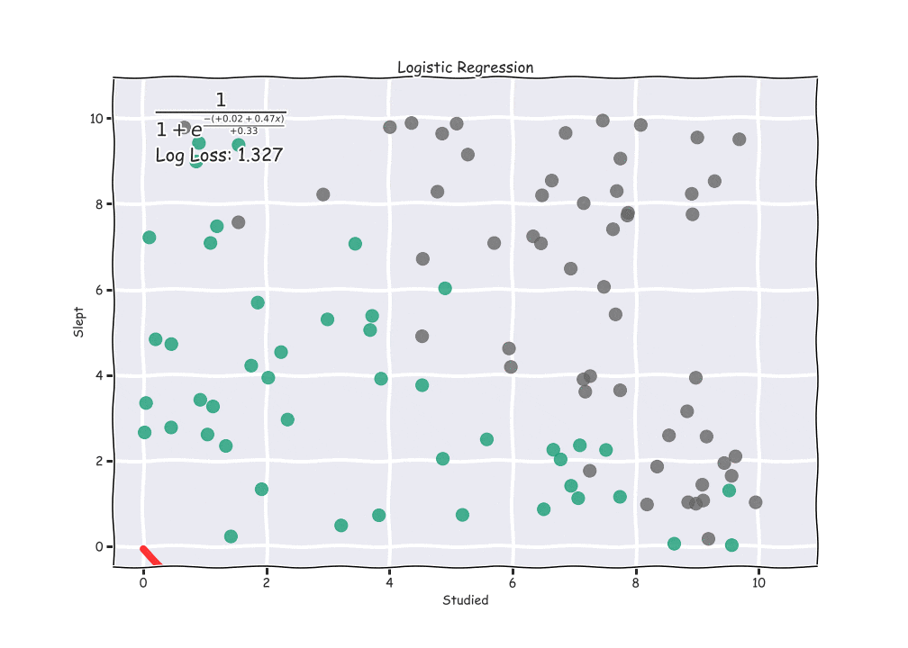

# Machine Learning From Scratch

Implementing Machine Learning Algorithms Using Only Numpy

# Table of Contents

1. [Linear Regression w/ Gradient Descent](./notebooks/Linear.ipynb)

2. [Logistic Regression w/ Gradient Descent](./notebooks/Logistic.ipynb)

3. [KMeans Clustering](./notebooks/KMeans.ipynb)
